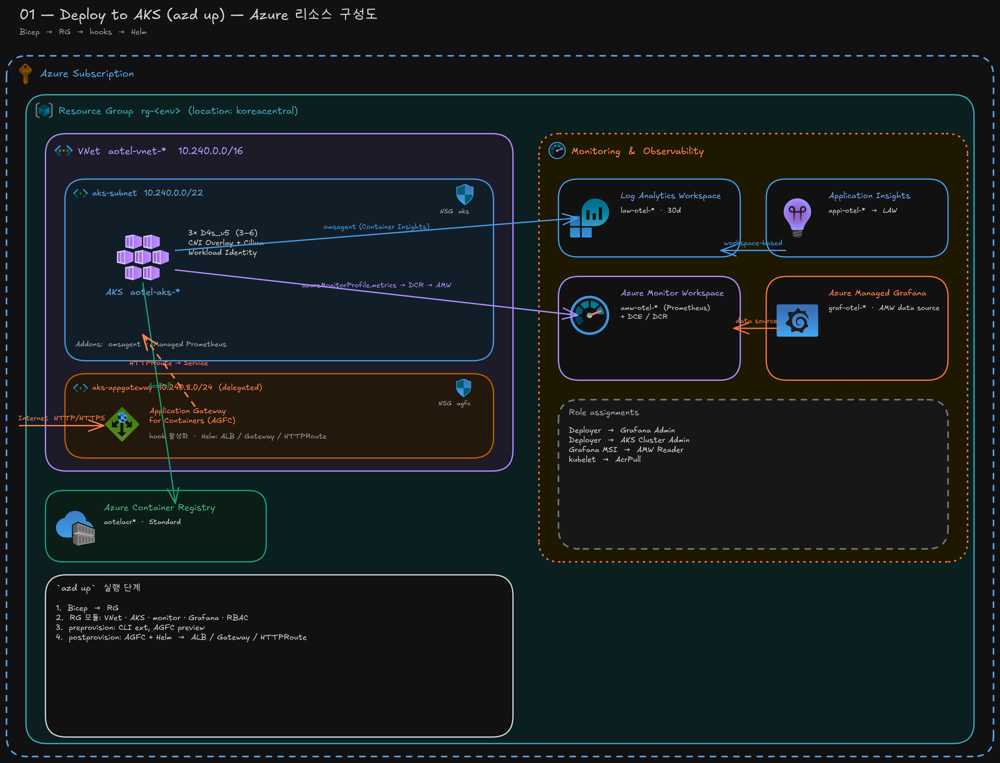
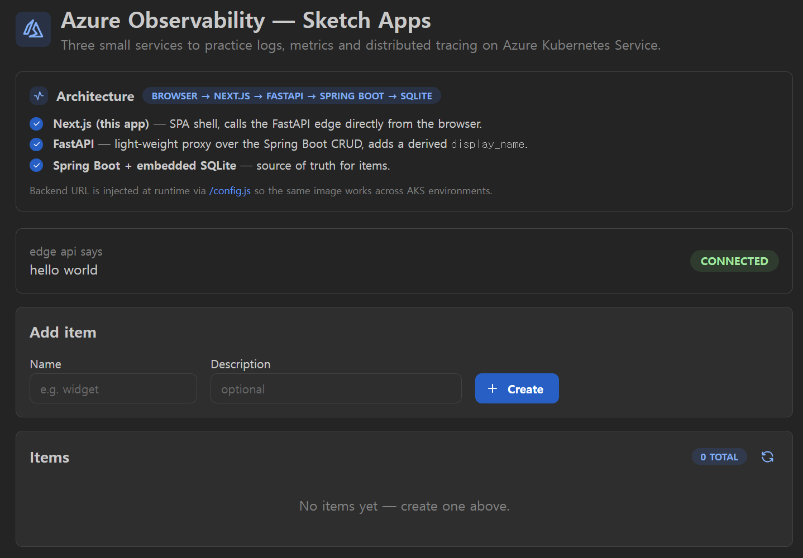

# 01 — Deploy to AKS (azd + Helm)

> English version: [README.md](./README.md)

AKS + 모니터링 스택(AMW, Grafana, App Insights, Log Analytics)을 프로비저닝하고
[`azure-otel/`](./azure-otel) Helm 차트를 배포합니다.



## Prerequisites

```powershell
winget install --id Microsoft.Azd        --silent --accept-source-agreements --accept-package-agreements
winget install --id Microsoft.AzureCLI   --silent --accept-source-agreements --accept-package-agreements
winget install --id Kubernetes.kubectl   --silent --accept-source-agreements --accept-package-agreements
winget install --id Helm.Helm            --silent --accept-source-agreements --accept-package-agreements
$env:Path = [Environment]::GetEnvironmentVariable('Path','Machine') + ';' + [Environment]::GetEnvironmentVariable('Path','User')
```

## 실행 순서

### 1. 로그인 & 환경 초기화

```powershell
cd c:\Users\inhwanhwang\vscode\azure-otel\01_deploy_to_aks

az login
azd auth login

azd env new dev
azd env set AZURE_LOCATION koreacentral
```

### 2. 인프라 프로비저닝 (Bicep만)

```powershell
azd up
```

`azd up`은 Bicep으로 AKS/모니터링 스택을 만들고 postprovision hook에서
Gateway API + ALB add-on 활성화 + AGFC subnet 권한 부여까지만 수행합니다.
**Helm 차트 배포는 포함되지 않습니다.**

### 3. kubectl 연결

```powershell
$rg  = (azd env get-value AZURE_RESOURCE_GROUP)
$aks = (azd env get-value AKS_NAME)
az aks get-credentials --resource-group $rg --name $aks --overwrite-existing
kubectl get nodes
```

### 4. Helm 차트 배포

```powershell
cd c:\Users\inhwanhwang\vscode\azure-otel
$subnetId = (azd env get-value AGFC_SUBNET_ID)
helm upgrade --install azure-otel .\01_deploy_to_aks\azure-otel `
  --namespace azure-otel --create-namespace `
  --set "gateway.subnetId=$subnetId" `
  --wait --timeout 10m

kubectl -n azure-otel get pods,svc
```

### 4-1. AGFC public 주소 확인

Helm 배포 후 Gateway가 public IP/FQDN을 받기까지 1–3분 정도 걸립니다.

```powershell
# 한 번만 조회
kubectl -n azure-otel get gateway azure-otel-gw `
  -o 'jsonpath={.status.addresses[0].value}'

# 받을 때까지 대기 (kubectl 1.23+)
kubectl -n azure-otel wait gateway/azure-otel-gw `
  --for=jsonpath='{.status.addresses[0].value}' --timeout=5m

# 받은 주소를 변수에 저장 + 바로 열기
$addr = kubectl -n azure-otel get gateway azure-otel-gw `
          -o 'jsonpath={.status.addresses[0].value}'
"http://$addr"
Start-Process "http://$addr"
```
`Gateway` / `HTTPRoute`는 Helm 차트가 만들고 AGFC 컨트롤러가 Application Gateway
for Containers의 frontend 주소를 `.status.addresses[0].value`에 채워 넣습니다.


agfc frontend 주소로 접근하면 다음과 같은 ui를 확인할 수 있습니다.


### 5. Grafana 열기

```powershell
$grafana = (azd env get-value GRAFANA_ENDPOINT)
$grafana                                  # URL 확인
Start-Process "msedge.exe" $grafana       # 또는 chrome.exe / iexplore.exe
# 한 줄로:  Start-Process -FilePath $grafana    (기본 브라우저)
```

`Start-Process (azd env get-value GRAFANA_ENDPOINT)` 가 실패한다면 azd가 출력한
경고가 함께 들어가 값이 배열이 됐거나 PS5의 URL 핸들러 동작 차이 때문입니다.
위처럼 변수에 먼저 담거나 `-FilePath`를 명시하면 안정적입니다.

### 6. 정리

```powershell
azd down --purge --force
```

---

## 참고

### 생성되는 리소스

리소스 그룹 `rg-<env>` 하위:

- **VNet** `aotel-vnet-*` (10.240.0.0/16) + private `aks-subnet` (10.240.0.0/22)
- **AKS** `aotel-aks-*` (Standard, 3× `Standard_D4s_v5` 3–5 autoscale, Azure CNI overlay,
  Cilium + NetworkPolicy, OIDC, Workload Identity, RBAC)
  - Container Insights (`omsagent`) → Log Analytics
  - Managed Prometheus (`azureMonitorProfile.metrics`) → AMW
- **Log Analytics** + **Application Insights** (workspace-based)
- **Azure Monitor Workspace** (managed Prometheus 백엔드)
- **Azure Managed Grafana** (Standard, AMW 데이터소스 연결)
- **ACR** `aotelacr*` (Standard, AKS kubelet에 `AcrPull` 부여)
- **AMPLS** + Private Endpoint (`aks-subnet`) + 6개 Private DNS Zone (VNet
  연결) — 03단계 collector가 App Insights에, ama-metrics가 AMW에 VNet 내부
  경로로 접근

Role assignments (`principalId` 자동 주입):

- Deployer → Grafana Admin / AKS RBAC Cluster Admin + Cluster User
- Grafana MSI → Monitoring Data Reader on AMW

### AMPLS + Private Link 아키텍처

`azd up`은 **Azure Monitor Private Link Scope (AMPLS)** 를 만들어 AKS pod ↔
Azure Monitor 간 모니터링 트래픽이 VNet 안에서만 흐르게 합니다. 아래 다이어그램에
생성되는 리소스와 연결 관계를 정리합니다:

```
┌─── AKS VNet ──────────────────────────────────────────────────────────┐
│                                                                       │
│  ama-metrics pod                                                      │
│    ├─ prometheus-collector (MDSD)                                     │
│    │    ├─ DCE 경유로 DCR 설정 읽기 (privatelink DNS → PE)              │
│    │    └─ DCE 경유로 메트릭 remote-write → AMW                        │
│    └─ MetricsExtension (port 55680)                                   │
│                                                                       │
│  otel-collector pod (03 단계)                                          │
│    └─ azuremonitor exporter → App Insights (privatelink DNS → PE)     │
│                                                                       │
│  ┌──── Private Endpoint (pe-ampls-*) ──────────────────────────────┐  │
│  │  aks-subnet 의 NIC → AMPLS 연결 서비스의 사설 IP                  │  │
│  └─────────────────────────────────────────────────────────────────┘  │
└───────────────────────────────────────────────────────────────────────┘
         │ 사설 IP 는 아래 DNS 존이 해석 ▼
   ┌─────────────────────────────────────────────────────────────────┐
   │  6 개 Private DNS Zone (VNet 에 링크)                           │
   │   • privatelink.monitor.azure.com                              │
   │   • privatelink.oms.opinsights.azure.com                       │
   │   • privatelink.ods.opinsights.azure.com                       │
   │   • privatelink.agentsvc.azure-automation.net                  │
   │   • privatelink.<region>.handler.control.monitor.azure.com     │
   │   • privatelink.<region>.ingest.monitor.azure.com              │
   └─────────────────────────────────────────────────────────────────┘
         │ A 레코드는 PE DNS Zone Group 이 자동 생성 ▼
   ┌─────────────────────────────────────────────────────────────────┐
   │  AMPLS (ampls-*) ── Scoped Resources:                         │
   │   • App Insights  (appi-link)                                  │
   │   • Log Analytics (law-link)                                   │
   │   • DCE           (dce-link)                                   │
   │  Access mode: Open / Open                                     │
   └─────────────────────────────────────────────────────────────────┘
```

**Data Collection 리소스** (Prometheus 메트릭 파이프라인):

| 리소스 | 이름 | 역할 |
|---|---|---|
| **DCE** (Data Collection Endpoint) | `dce-*` | ama-metrics 의 인입 + 설정 엔드포인트. AMPLS 에 링크되어 트래픽이 PE 를 경유. |
| **DCR** (Data Collection Rule) | `dcr-*` | `PrometheusForwarder` 데이터 소스 → AMW 대상 정의. `dataCollectionEndpointId` 로 DCE 참조. |
| **DCRA** (DCR Association) | `send-to-amw` | DCR 을 AKS 클러스터에 연결. ama-metrics 에게 어떤 DCR 이 데이터 흐름을 정의하는지 알려줌. |
| **DCRA** (DCE Association) | `configurationAccessEndpoint` | DCE 를 AKS 클러스터에 연결. **Private link 필수** — 없으면 MDSD 가 DCE endpoint 를 모르고, AMCS 에서 `403 InvalidAccess` 발생. |

> **왜 DCRA 가 두 개?** DCR DCRA 는 *무엇을 수집해서 어디로 보낼지*, DCE
> DCRA (`configurationAccessEndpoint`) 는 *설정 서비스에 어떻게 접근할지*를
> 알려줍니다. Private DNS 존이 `*.monitor.azure.com` 을 사설 IP 로 해석하면
> AMCS 는 DCE 경유 설정 접근을 요구합니다 — DCE DCRA 가 없으면
> `ENDPOINT_FQDN` 이 비어서 MDSD 가 403 을 받습니다.

### `azd up`이 수행하는 단계

1. Subscription-scope Bicep으로 RG 생성
2. RG 모듈로 VNet, AKS, 모니터링, Grafana, role assignment 생성
3. `preprovision` hook: Azure CLI 확장 설치, AGFC preview feature/provider 등록
4. `postprovision` hook: AKS Gateway API + AGFC 활성화, ALB MSI에 `aks-appgateway`
   서브넷 권한 부여

> Helm 차트 설치는 azd 사이클에서 분리되어 있습니다 (위 4단계 참고).

### azd 환경 값 확인

```powershell
azd env get-values | Select-String -Pattern '^(AKS_|GRAFANA_|APPLICATION_INSIGHTS_|AZURE_MONITOR_|LOG_ANALYTICS_|AZURE_RESOURCE_GROUP|VNET_|AGFC_|ACR_)'
```

### Private cluster

`infra/main.parameters.json`에서 `enablePrivateCluster=true`이면 VNet 내부
(bastion/VPN) 또는 `az aks command invoke`를 통해 `kubectl`을 실행해야 합니다.

### GHCR 이미지 권한

이미지(`ghcr.io/hellices/azure-otel:<service>-latest`)가 private이면
`ImagePullBackOff`가 발생합니다. 둘 중 하나로 해결:

**A. 패키지를 Public으로 변경 (1회)**
https://github.com/users/hellices/packages/container/azure-otel/settings → Change visibility → Public

**B. Pull secret 사용**

```powershell
$ghcrUser  = 'hellices'
$ghcrToken = '<PAT with read:packages>'
kubectl create namespace azure-otel
kubectl -n azure-otel create secret docker-registry ghcr `
  --docker-server=ghcr.io --docker-username=$ghcrUser --docker-password=$ghcrToken
# Helm:  --set 'global.imagePullSecrets[0].name=ghcr'
```

### Ingress 없이 스모크 테스트

```powershell
helm upgrade --install azure-otel .\01_deploy_to_aks\azure-otel `
  --namespace azure-otel --set nodejs.pythonPublicBaseUrl=http://localhost:8000

kubectl -n azure-otel port-forward svc/azure-otel-nodejs 3000:3000   # 터미널 A
kubectl -n azure-otel port-forward svc/azure-otel-python 8000:8000   # 터미널 B
# http://localhost:3000
```

공인 엔드포인트는 `azd up`이 Gateway API + AGFC를 자동 구성하며, 그 다음
Helm 차트(4단계)가 `ApplicationLoadBalancer` / `Gateway` / `HTTPRoute`를 생성합니다.

### Tear down 옵션

`--purge`는 soft-delete 가능한 리소스(App Insights, Log Analytics, Grafana)를
영구 삭제합니다. 보존하려면 생략하세요.
