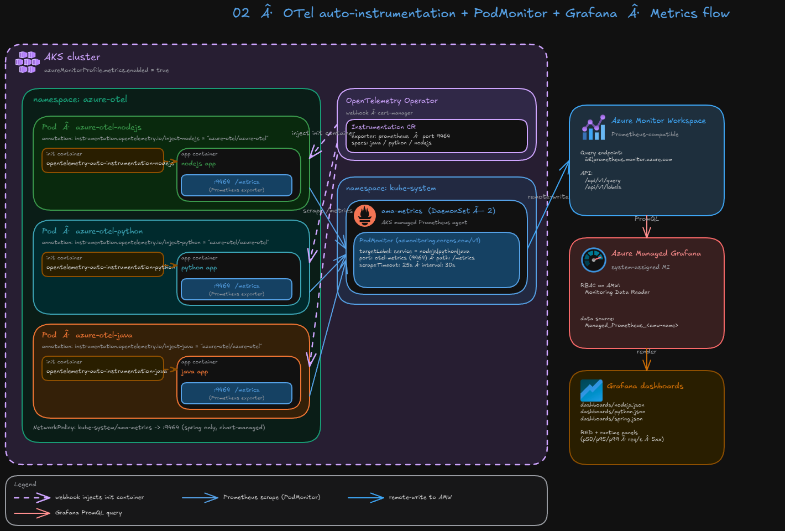
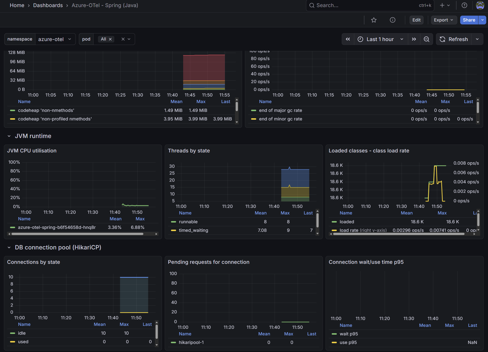

# 02 — OTel auto-instrumentation + PodMonitor + Grafana 대시보드

> English version: [README.md](./README.md)

[01_deploy_to_aks](../01_deploy_to_aks)에서 만든 AKS 클러스터에
**OpenTelemetry Operator**로 자동계측을 주입하고,
앱이 노출하는 `:9464/metrics`를 **PodMonitor**로 ama-metrics가 스크레이프해
**Azure Monitor Workspace(AMW)** 에 쌓인 메트릭을 **Managed Grafana**의 3개
서비스(Node.js / Python / Spring) 대시보드로 시각화합니다.



```
[App pod]                                  ┌──► (App Insights — step 03)
 ├─ init: otel-auto-instrumentation        │
 │    └─ Java/Python/Node SDK 주입         │
 └─ app container :9464/metrics  ──────────┴──► [ama-metrics]
                                                  │ remote-write
                                                  ▼
                                                [AMW]  ─►  [Managed Grafana]
                                                                │
                                                                ▼
                                            nodejs.json / python.json / spring.json
```

## 사전 작업 (01단계에서 완료)

01단계 Helm 차트가 `otel.enabled=true` (기본값)일 때 아래를 자동으로
포함시키므로, 02단계에서는 Operator + Instrumentation + PodMonitor만
추가하면 메트릭이 흘러가기 시작합니다:

- 각 Deployment의 Pod template에
  `instrumentation.opentelemetry.io/inject-{java|python|nodejs}` 및
  `instrumentation.opentelemetry.io/container-names` annotation
- 각 컨테이너에 named port `otel-metrics: 9464`
- spring NetworkPolicy에 `kube-system/ama-metrics` → `:9464` ingress 규칙 추가
  (nodejs/python은 차트가 NP를 구성하지 않으므로 default-allow)

때문에 아래 단계에는 `kubectl patch deploy ...` 같은 작업이 없습니다.

## 실행 순서

### 1. OpenTelemetry Operator 설치

공식 릴리스 매니페스트를 `kubectl apply`로 올립니다. Operator의
admission webhook이 TLS 인증서를 요구하므로 **cert-manager**가 필요합니다.
이미 설치되어 있으면 건너뛰세요:

```bash
# (A) cert-manager (없을 때만)
kubectl get ns cert-manager 2>/dev/null
kubectl apply -f https://github.com/cert-manager/cert-manager/releases/latest/download/cert-manager.yaml
kubectl -n cert-manager rollout status deploy/cert-manager-webhook --timeout=180s

# (B) OpenTelemetry Operator
kubectl apply -f https://github.com/open-telemetry/opentelemetry-operator/releases/latest/download/opentelemetry-operator.yaml
kubectl -n opentelemetry-operator-system rollout status deploy/opentelemetry-operator-controller-manager --timeout=180s

kubectl -n opentelemetry-operator-system get pods
kubectl get crd | grep opentelemetry
```

### 2. Instrumentation CR 적용

각 언어 SDK가 init container로 주입될 때 어떤 ENV를 세팅할지 선언합니다.
metrics는 **Prometheus exporter(`:9464/metrics`)** 로 노출, traces/logs는
이번 단계에서 끕니다(03단계에서 OTLP로 전환).

```bash
cd ./02_metrics_via_podmonitor   # 레포 루트에서
kubectl apply -f manifests/instrumentation.yaml
kubectl -n azure-otel get instrumentation
```

CR이 생기면 OTel Operator webhook이 차트가 미리 달아둔 annotation을 보고
init container를 주입합니다. 이미 돌고 있는 Pod는 한 번 restart 해야
주입이 반영됩니다.

> `kubectl apply -f manifests/instrumentation.yaml` 후 **10초 정도 대기** 후
> restart 하세요. 너무 빨리 하면 webhook이 CR을 아직 reconcile 하지 못해
> 일부 pod에 init container가 주입되지 않을 수 있습니다.

```bash
kubectl -n azure-otel rollout restart deploy azure-otel-spring azure-otel-python azure-otel-nodejs
kubectl -n azure-otel rollout status   deploy azure-otel-spring --timeout=180s
kubectl -n azure-otel rollout status   deploy azure-otel-python --timeout=180s
kubectl -n azure-otel rollout status   deploy azure-otel-nodejs --timeout=180s
```

각 Pod에 `opentelemetry-auto-instrumentation-*` init container가 있는지 확인:

```bash
kubectl -n azure-otel get pods -o jsonpath='{range .items[*]}{.metadata.name}{"\t"}{range .spec.initContainers[*]}{.name}{", "}{end}{"\n"}{end}'
```

init container가 빠진 pod가 있으면 해당 deployment만 다시 restart 하세요.

### 3. 앱이 9464에서 메트릭을 노출하는지 확인

서비스 이름만 바꿔 3번 반복:

```bash
# 터미널 1
kubectl -n azure-otel port-forward deploy/azure-otel-spring 9464:9464

# 터미널 2
curl -s http://localhost:9464/metrics | grep 'http_server' | head -5
```

`http_server_request_duration_seconds_bucket`, `process_*`, JVM의 경우
`jvm_memory_used_bytes` 등이 보이면 OK.

### 4. PodMonitor 적용

```bash
kubectl apply -f manifests/podmonitor.yaml
kubectl -n azure-otel get podmonitor.azmonitoring.coreos.com
```

> CRD를 새로 만든 직후라면 ama-metrics를 한 번 재시작해 주는 것이 빠릅니다:
>
> ```bash
> kubectl -n kube-system rollout restart deploy/ama-metrics
> ```

타겟 상태 확인은 다음 단계(5·B) Grafana Explore에서 하면 됩니다.
더 깊게 보고 싶으면 ama-metrics 파드에 :9090 port-forward 후
`/api/v1/targets`를 직접 조회하세요 (ama-metrics는 2개 레플리카로
샤딩되므로 두 파드 모두 봐야 전체 타겟이 보입니다).

### 5. AMW에서 메트릭 도착 확인

#### A. AMW Prometheus endpoint를 직접 질의 (가장 정확)

> `azd env get-value`는 `azure.yaml`이 있는 `01_deploy_to_aks` 디렉토리가
> 필요합니다. `--cwd` 플래그로 `cd` 없이 참조할 수 있습니다.

<details>
<summary><strong>macOS / Linux</strong></summary>

```bash
amwUrl=$(az monitor account show \
  -g "$(azd env get-value AZURE_RESOURCE_GROUP --cwd ../01_deploy_to_aks)" \
  -n "$(azd env get-value AZURE_MONITOR_WORKSPACE_NAME --cwd ../01_deploy_to_aks)" \
  --query metrics.prometheusQueryEndpoint -o tsv)
amwTok=$(az account get-access-token \
  --resource https://prometheus.monitor.azure.com \
  --query accessToken -o tsv)
curl -sS -H "Authorization: Bearer $amwTok" \
  "$amwUrl/api/v1/query?query=count%20by%20(service)%20(up%7Bnamespace%3D%22azure-otel%22%7D)"
```

</details>

<details open>
<summary><strong>Windows (PowerShell)</strong></summary>

```powershell
$amwUrl = az monitor account show `
  -g "$(azd env get-value AZURE_RESOURCE_GROUP --cwd ../01_deploy_to_aks)" `
  -n "$(azd env get-value AZURE_MONITOR_WORKSPACE_NAME --cwd ../01_deploy_to_aks)" `
  --query metrics.prometheusQueryEndpoint -o tsv
$amwTok = az account get-access-token `
  --resource https://prometheus.monitor.azure.com `
  --query accessToken -o tsv
Invoke-RestMethod -Uri "$amwUrl/api/v1/query?query=count%20by%20(service)%20(up%7Bnamespace%3D%22azure-otel%22%7D)" `
  -Headers @{ Authorization = "Bearer $amwTok" }
```

</details>

`{"service":"nodejs"}`, `python`, `spring` 세 개가 나오면 파이프라인 OK.

#### B. Managed Grafana → AMW 경로 확인

Grafana 포털 주소 확인:

<details>
<summary><strong>macOS / Linux</strong></summary>

```bash
az grafana show \
  -n "$(azd env get-value GRAFANA_NAME --cwd ../01_deploy_to_aks)" \
  -g "$(azd env get-value AZURE_RESOURCE_GROUP --cwd ../01_deploy_to_aks)" \
  --query properties.endpoint -o tsv
```

</details>

<details open>
<summary><strong>Windows (PowerShell)</strong></summary>

```powershell
az grafana show `
  -n "$(azd env get-value GRAFANA_NAME --cwd ../01_deploy_to_aks)" `
  -g "$(azd env get-value AZURE_RESOURCE_GROUP --cwd ../01_deploy_to_aks)" `
  --query properties.endpoint -o tsv
```

</details>

Managed Grafana → Explore → 데이터 소스: **Managed_Prometheus_<amw-name>**

```promql
up{namespace="azure-otel"}
sum by (service) (rate(http_server_request_duration_seconds_count[5m]))
```

> Grafana가 401 / `Authentication to data source failed`를 리턴하면
> AMG의 system-assigned MI에 `Monitoring Data Reader` 역할이 AMW에
> 없거나 (5명 ~ 수 분) AAD propagation 대기입니다.
>
> ```bash
> mi=$(az grafana show \
>   -n "$(azd env get-value GRAFANA_NAME --cwd ../01_deploy_to_aks)" \
>   -g "$(azd env get-value AZURE_RESOURCE_GROUP --cwd ../01_deploy_to_aks)" \
>   --query identity.principalId -o tsv)
> amwId=$(az monitor account show \
>   -n "$(azd env get-value AZURE_MONITOR_WORKSPACE_NAME --cwd ../01_deploy_to_aks)" \
>   -g "$(azd env get-value AZURE_RESOURCE_GROUP --cwd ../01_deploy_to_aks)" \
>   --query id -o tsv)
> az role assignment create --assignee-object-id "$mi" \
>   --assignee-principal-type ServicePrincipal \
>   --role 'Monitoring Data Reader' --scope "$amwId"
> ```

<details open>
<summary><strong>Windows (PowerShell)</strong></summary>

```powershell
$mi = az grafana show `
  -n "$(azd env get-value GRAFANA_NAME --cwd ../01_deploy_to_aks)" `
  -g "$(azd env get-value AZURE_RESOURCE_GROUP --cwd ../01_deploy_to_aks)" `
  --query identity.principalId -o tsv
$amwId = az monitor account show `
  -n "$(azd env get-value AZURE_MONITOR_WORKSPACE_NAME --cwd ../01_deploy_to_aks)" `
  -g "$(azd env get-value AZURE_RESOURCE_GROUP --cwd ../01_deploy_to_aks)" `
  --query id -o tsv
az role assignment create --assignee-object-id $mi `
  --assignee-principal-type ServicePrincipal `
  --role 'Monitoring Data Reader' --scope $amwId
```

</details>

### 6. Grafana 대시보드 import (Node / Python / Spring)

Managed Grafana 콘솔에서:

1. 좌측 **Dashboards → New → Import**
2. `dashboards/nodejs.json` 내용을 붙여넣기 → Load
3. 데이터 소스에서 **Managed_Prometheus_<amw-name>** 선택
4. `python.json`, `spring.json` 동일하게 반복

3개이지만 UI가 가장 간단합니다. CLI로 일괄 import 하고 싶으면
아래 절차를 참고하세요:

<details open><summary>CLI로 import — macOS / Linux (선택)</summary>

```bash
grafana=$(azd env get-value GRAFANA_ENDPOINT --cwd ../01_deploy_to_aks)
# Azure Managed Grafana용 audience (고정 GUID)
token=$(az account get-access-token \
  --resource ce34e7e5-485f-4d76-964f-b3d2b16d1e4f \
  --query accessToken -o tsv)
for f in dashboards/nodejs.json dashboards/python.json dashboards/spring.json; do
  jq '{dashboard: (. | .id = null), overwrite: true, folderId: 0}' "$f" > body.json
  curl -sS -X POST "$grafana/api/dashboards/db" \
    -H "Authorization: Bearer $token" -H 'Content-Type: application/json' \
    --data-binary @body.json
  echo
done
rm -f body.json
```

</details>

<details open><summary>CLI로 import — Windows PowerShell (선택)</summary>

```powershell
$grafana = azd env get-value GRAFANA_ENDPOINT --cwd ../01_deploy_to_aks
$token = az account get-access-token `
  --resource ce34e7e5-485f-4d76-964f-b3d2b16d1e4f `
  --query accessToken -o tsv
foreach ($f in "dashboards/nodejs.json","dashboards/python.json","dashboards/spring.json") {
  $body = Get-Content $f | ConvertFrom-Json
  $body.id = $null
  $payload = @{ dashboard = $body; overwrite = $true; folderId = 0 } | ConvertTo-Json -Depth 20
  Invoke-RestMethod -Uri "$grafana/api/dashboards/db" -Method Post `
    -Headers @{ Authorization = "Bearer $token"; "Content-Type" = "application/json" } `
    -Body $payload
}
```

</details>

## 대시보드에서 보는 항목

각 대시보드는 RED + 런타임 패널로 구성:

| 패널 | PromQL 요지 |
|---|---|
| Request rate (req/s) | `sum(rate(http_server_request_duration_seconds_count[5m]))` |
| Error rate (5xx, %) | 5xx ratio |
| Latency p50/p95/p99 (ms) | `histogram_quantile` over `_bucket` |
| Throughput by route | `sum by (http_route) (rate(...))` |
| Runtime (언어별) | Node: event loop / heap, Python: CPU / RSS, Java: JVM heap pool / GC pause / threads |

`namespace` 변수와 `service=…` label은 PodMonitor의 relabeling이 채워줍니다.



## 트러블슈팅

| 증상 | 원인 / 해결 |
|---|---|
| Pod에 init container가 안 붙음 | Instrumentation CR이 아직 적용 안 됐거나 (`kubectl -n azure-otel get instrumentation`) Operator/cert-manager 파드가 Ready가 아님. CR 적용 후 Pod는 한 번 restart 필요 |
| `up{service="spring"}=0` 혹은 `context deadline exceeded` | spring NetworkPolicy가 ama-metrics에서의 9464 트래픽을 드롭. 01단계 values에서 `otel.scrapeNetworkPolicy=true`(기본) 확인 |
| Spring 메트릭이 가끔 down | JVM 스타트업 중에는 30초+ 걸릴 수 있음. PodMonitor `scrapeTimeout: 25s` 을 적용해 둔 이유 |
| `:9464` 응답 없음 | SDK가 prometheus exporter를 못 켰거나 포트 충돌. `kubectl logs <pod> -c spring \| grep -i prometheus` |
| Grafana에 메트릭 없음 | ama-metrics가 PodMonitor CRD를 아직 못 봤을 수 있음. `kubectl -n kube-system rollout restart deploy/ama-metrics` |
| `http_response_status_code` label이 없음 | OTel SDK 버전에 따라 `http_status_code` 등 다른 이름. 패널 PromQL의 label 이름을 실제 노출되는 라벨로 교체 |
| AMW 쿼리 403 `Data collection endpoint must be used…` | AMPLS / Private Link가 활성인데 `configurationAccessEndpoint` DCRA(DCE → AKS 연결)가 없음. ama-metrics가 scrape 설정을 받아오지 못함. `az monitor data-collection rule association create --name configurationAccessEndpoint --resource <aksId> --data-collection-endpoint-id <dceId>`로 생성. [01_deploy_to_aks/README](../01_deploy_to_aks/README_KR.md)의 AMPLS 섹션 참조. |
| Grafana 401 / `Authentication to data source failed` | Managed Grafana의 system-assigned MI에 AMW에 대한 `Monitoring Data Reader` 역할이 없음. 5·B 단계의 role assignment 명령 실행 후 AAD 전파까지 몇 분 대기. |
| `azd env get-value` 빈 값 / `no project exists` | `azure.yaml`이 있는 `01_deploy_to_aks/` 디렉토리에서 실행하지 않았음. `cd`로 이동하거나 `--cwd ../01_deploy_to_aks`를 추가. |
| 대시보드 패널이 전부 Azure Monitor로 표시 | JSON의 datasource UID가 현재 Grafana 인스턴스와 불일치. 대시보드는 `${datasource}` 변수를 사용하므로 import 후 상단 **Prometheus** 드롭다운에서 `Managed_Prometheus_<amw-name>`을 선택. |
| CR 적용했는데 init container가 안 붙음 | Race condition — `kubectl apply -f instrumentation.yaml` 직후 바로 restart하면 webhook이 아직 CR을 reconcile하지 못함. ~10초 대기 후 해당 deployment만 다시 restart. |

## 다음 단계

- **03**: OTel Collector를 클러스터에 배포해 `:9464` Prometheus exporter 대신
  **OTLP**로 traces/logs/metrics를 묶고, **AMPLS + DCE/DCR**로 Application
  Insights / AMW / Log Analytics에 private 경로로 전송.
