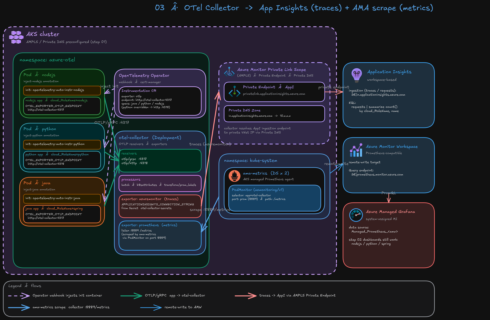

# 03 — OTLP Collector → App Insights (traces) + AMA scrape (metrics)

Once stages 01 and 02 are done, replace the SDK's direct `:9464/metrics`
exposure with an in-cluster **OTel Collector**. SDKs only speak OTLP and
the collector splits the signal:

- **traces** → `azuremonitor` exporter → Application Insights (via AMPLS)
- **metrics** → `prometheus` exporter on `:8889` → ama-metrics scrape → AMW

> Korean version: [README_KR.md](./README_KR.md)



```
app pod ─OTLP─► otel-collector ─┬─► AppI (private via AMPLS)
                                └─► :8889/metrics ◄─ ama-metrics ─► AMW ─► Grafana
```

Protocol per language (set in `instrumentation.yaml`):

| Language | OTLP protocol | Collector port |
|---|---|---|
| Java   | gRPC          | 4317 |
| Node   | gRPC          | 4317 |
| Python | HTTP/protobuf | 4318 |

Why Python uses HTTP: the upstream `autoinstrumentation-python` image only
bundles `opentelemetry-exporter-otlp-proto-http` (the gRPC exporter is
omitted to avoid the heavy native `grpcio` wheel). Forcing `grpc` causes
`Requested component 'otlp_proto_grpc' not found` at startup.

The traces pipeline runs `filter/drop_healthchecks` before `batch` to drop
spans for `/health`, `/healthz`, `/livez`, `/readyz` so probe traffic does
not pollute Application Insights. Health-check **metrics** are still
emitted (kept for Grafana availability panels).

AMPLS / Private Endpoint / Private DNS Zones are already provisioned by the
step 01 Bicep, so there is no extra infra work here.

## 0. Clean up stage 02

> All commands below assume you are inside `03_otel_observability/`.

```bash
cd 03_otel_observability    # from repo root

kubectl -n azure-otel delete podmonitor.azmonitoring.coreos.com azure-otel-apps --ignore-not-found
kubectl -n azure-otel delete instrumentation azure-otel --ignore-not-found
```

## 1. Create the connection string Secret + apply manifests

<details>
<summary><strong>macOS / Linux</strong></summary>

```bash
kubectl -n azure-otel create secret generic otel-collector-secrets \
  --from-literal=APPLICATIONINSIGHTS_CONNECTION_STRING="$(azd env get-value APPLICATION_INSIGHTS_CONNECTION_STRING --cwd ../01_deploy_to_aks)" \
  --dry-run=client -o yaml | kubectl apply -f -

kubectl apply -f manifests/collector.yaml
kubectl apply -f manifests/instrumentation.yaml

kubectl -n azure-otel rollout status deploy/otel-collector --timeout=180s
kubectl -n azure-otel rollout restart deploy azure-otel-spring azure-otel-python azure-otel-nodejs
```

</details>

<details open>
<summary><strong>Windows (PowerShell)</strong></summary>

```powershell
$connStr = azd env get-value APPLICATION_INSIGHTS_CONNECTION_STRING --cwd ../01_deploy_to_aks
kubectl -n azure-otel create secret generic otel-collector-secrets `
  --from-literal=APPLICATIONINSIGHTS_CONNECTION_STRING="$connStr" `
  --dry-run=client -o yaml | kubectl apply -f -

kubectl apply -f manifests/collector.yaml
kubectl apply -f manifests/instrumentation.yaml

kubectl -n azure-otel rollout status deploy/otel-collector --timeout=180s
kubectl -n azure-otel rollout restart deploy azure-otel-spring azure-otel-python azure-otel-nodejs
```

</details>

If ama-metrics doesn't see the new PodMonitor, restart it once:

```bash
kubectl -n kube-system rollout restart deploy/ama-metrics
```

## 2. Verify

```bash
kubectl -n azure-otel logs deploy/otel-collector --tail=50

# Confirm metrics are exposed on :8889/metrics
kubectl -n azure-otel port-forward deploy/otel-collector 8889:8889
curl -s http://localhost:8889/metrics | grep -m1 http_server_request_duration_seconds_count
```

In Application Insights → **Transaction search** or Logs:

```kusto
requests | where timestamp > ago(15m)
| summarize count() by cloud_RoleName, name
```

Seeing `cloud_RoleName` of `spring`, `python`, and `nodejs` means traces are
flowing. The stage 02 Grafana dashboards keep working unchanged.

## 3. View traces

The same trace data is reachable from two UIs:

### Application Insights (Azure portal)

- **Investigate → Transaction search** — click any request to open the
  end-to-end transaction (Gantt waterfall across nodejs / python / spring).
- **Investigate → Application map** — service topology with call rate, error
  rate, and latency on each edge.
- **Monitoring → Logs** — KQL over `requests` / `dependencies` / `traces`
  / `exceptions`. Same `operation_Id` ties spans together across services.

### Azure Managed Grafana (Tempo-style)

The built-in **Azure Monitor** datasource has an Application Insights
**Traces** mode that reuses Grafana's trace viewer.

1. Grant the Grafana managed identity `Monitoring Reader` on the App
   Insights resource (one-time):

   <details>
   <summary><strong>macOS / Linux</strong></summary>

   ```bash
   rg=$(azd env get-value AZURE_RESOURCE_GROUP --cwd ../01_deploy_to_aks)
   ai=$(azd env get-value APPLICATION_INSIGHTS_NAME --cwd ../01_deploy_to_aks)
   gfn=$(az resource list -g "$rg" --resource-type Microsoft.Dashboard/grafana --query "[0].name" -o tsv)
   gid=$(az grafana show -n "$gfn" -g "$rg" --query identity.principalId -o tsv)
   aiid=$(az monitor app-insights component show -g "$rg" -a "$ai" --query id -o tsv)
   az role assignment create --assignee-object-id "$gid" --assignee-principal-type ServicePrincipal \
     --role "Monitoring Reader" --scope "$aiid"
   ```

   </details>

   <details open>
   <summary><strong>Windows (PowerShell)</strong></summary>

   ```powershell
   $rg = azd env get-value AZURE_RESOURCE_GROUP --cwd ../01_deploy_to_aks
   $ai = azd env get-value APPLICATION_INSIGHTS_NAME --cwd ../01_deploy_to_aks
   $gfn = az resource list -g $rg --resource-type Microsoft.Dashboard/grafana --query "[0].name" -o tsv
   $gid = az grafana show -n $gfn -g $rg --query identity.principalId -o tsv
   $aiid = az monitor app-insights component show -g $rg -a $ai --query id -o tsv
   az role assignment create --assignee-object-id $gid --assignee-principal-type ServicePrincipal `
     --role "Monitoring Reader" --scope $aiid
   ```

   </details>
2. Grafana → **Explore** → datasource **Azure Monitor** → Service
   **Application Insights** → Query type **Traces** → pick the App Insights
   resource → paste a `Trace ID` (= `operation_Id`) → widen the time range
   to cover the trace timestamp → **Run query**.
3. The stage-02 dashboards include a **Recent traces (App Insights)** table
   panel; click a row's `operation_Id` to jump straight to the trace viewer.

## Troubleshooting

| Symptom | Cause / fix |
|---|---|
| Operator webhook doesn't inject init container | Check cert-manager / Operator pods are Ready. After applying the CR you must restart pods once. |
| Collector logs `connection refused` (azuremonitor) | AMPLS Private DNS isn't in place. `kubectl -n azure-otel exec deploy/otel-collector -- nslookup <region>.in.applicationinsights.azure.com` should resolve to a private IP. |
| AppI Live Metrics is OK but Transactions are empty | Connection String Secret didn't take — recreate the Secret and restart the collector. |
| Grafana shows 0 metrics | ama-metrics didn't pick up the new PodMonitor. `kubectl -n kube-system rollout restart deploy/ama-metrics` |
| Metric labels (`service`, `k8s_pod`) missing | OTel SDK version differences. Inspect raw output at `:8889/metrics` and adjust the `transform/prom_labels` mappings. |
| Python pod logs `Requested component 'otlp_proto_grpc' not found` | The Python auto-instrument image has no gRPC exporter. Keep `OTEL_EXPORTER_OTLP_PROTOCOL=http/protobuf` and the `:4318` endpoint in the Python block of `instrumentation.yaml`. |
| Health-check spans still appear in App Insights | App uses a non-standard probe path. Add it to the regex in the `filter/drop_healthchecks` processor in `collector.yaml`. |
