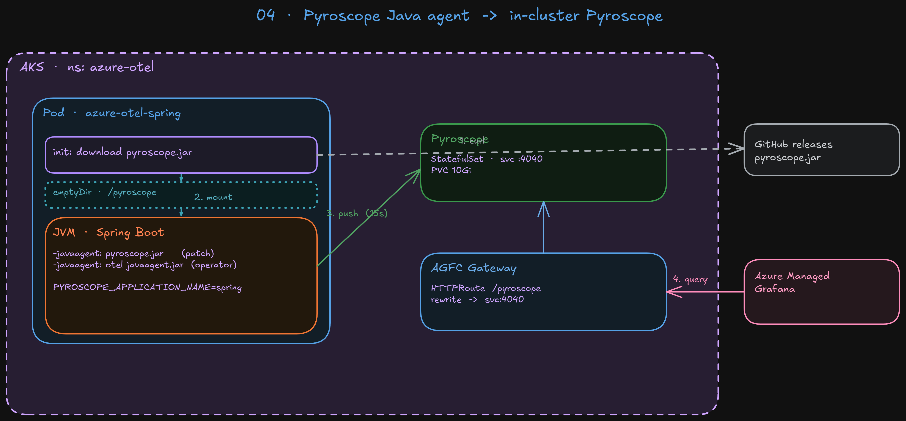

# 04 — Java continuous profiling with the Pyroscope SDK (no app changes)

Stages 01–03 give us metrics + traces. This stage adds the **profiling**
signal **for the Spring Boot service only**, using the official
[Pyroscope Java agent](https://github.com/grafana/pyroscope-java) injected
as a sidecar `-javaagent` — the application image and source code are
untouched.

> Korean version: [README_KR.md](./README_KR.md)



OpenTelemetry's profiling signal is still **Development** as of 2026-05
(OTLP `profiles` data model exists, SDK + spec are not GA). Pyroscope's
own SDK is the practical interim path. Among the three sample languages,
**Java is the only one that supports a fully no-code injection** via
`-javaagent`:

| Service | Native SDK injection without code change? |
|---|---|
| Spring (Java) | ✅ `-javaagent` + env vars (this stage) |
| FastAPI (Python) | ❌ requires `pyroscope.configure(...)` at startup |
| Next.js (Node) | ⚠️ requires `--require` bootstrap script |

Python and Node are intentionally left out for now — their SDKs need a
process-level bootstrap that this repo's "no app changes" rule doesn't
allow. They can be added later with eBPF (Grafana Alloy `pyroscope.ebpf`)
or with `pyroscope-otel` bridges.

```
spring pod (OTel javaagent + Pyroscope javaagent)
    │
    └─ HTTP push ─► pyroscope (in-cluster) ─► UI :4040
                                              │
                                              └─ (optional) AGFC HTTPRoute
                                                 ─► AMG datasource
```

| Component | Purpose |
|---|---|
| `pyroscope` (Helm, single binary) | Profiles store + UI on `:4040` |
| `spring-pyroscope-patch.yaml` | initContainer downloads `pyroscope.jar`; env vars wire it to the JVM and Pyroscope server |
| (optional) `HTTPRoute` on AGFC | Exposes Pyroscope behind the existing gateway for AMG |

The patch sets `PYROSCOPE_APPLICATION_NAME=spring` so the Pyroscope label
`service_name` matches the `service=spring` label used by the step-02/03
dashboards — metrics ↔ flame graph correlation comes for free.

## Prerequisites

- Stages 01–03 are running (`azure-otel` namespace, sample apps, OTel
  Collector). The Spring deployment must be `azure-otel-spring`.
- AKS pods can reach `github.com` for the agent download (default egress
  is open). If outbound is locked down, mirror `pyroscope.jar` to ACR and
  edit the initContainer image / URL.

## 1. Install Pyroscope

> All commands below assume you are inside `04_profiling_with_pyroscope/`.

```bash
cd 04_profiling_with_pyroscope    # from repo root

helm repo add grafana https://grafana.github.io/helm-charts
helm repo update

helm upgrade --install pyroscope grafana/pyroscope \
  -n azure-otel \
  -f manifests/pyroscope-values.yaml

kubectl -n azure-otel rollout status statefulset/pyroscope --timeout=180s
```

## 2. Inject the Pyroscope Java agent into the Spring deployment

```bash
kubectl -n azure-otel patch deploy azure-otel-spring \
  --patch-file manifests/spring-pyroscope-patch.yaml
kubectl -n azure-otel rollout status deploy/azure-otel-spring --timeout=180s
```

Verify both javaagents loaded:

```bash
kubectl -n azure-otel logs deploy/azure-otel-spring --tail=20 | grep -iE 'pyroscope|javaagent|otel'
kubectl -n azure-otel exec deploy/azure-otel-spring -- printenv JAVA_TOOL_OPTIONS
# Expected:
#   -javaagent:/pyroscope/pyroscope.jar -javaagent:/otel-auto-instrumentation-java/javaagent.jar
```

The OTel Operator's mutating webhook **preserves** `JAVA_TOOL_OPTIONS`
when it injects its own auto-instrumentation, so both agents end up loaded
without conflicts.

## 3. Verify ingestion

Generate some CPU work:

```bash
alb=$(kubectl -n azure-otel get gateway azure-otel-gw -o 'jsonpath={.status.addresses[0].value}')
for i in $(seq 1 200); do curl -s "http://$alb/api/items" > /dev/null; done
```

Open the Pyroscope UI:

```bash
kubectl -n azure-otel port-forward svc/pyroscope 4040:4040
# browse http://localhost:4040
```

In the UI:

1. **Explore profiles** → `service_name = spring` should appear.
2. Profile types available (because `PYROSCOPE_FORMAT=jfr`):
   - `process_cpu / cpu (nanoseconds)` — on-CPU sampler (`itimer`)
   - `memory / alloc_in_new_tlab_bytes` — allocations
   - `mutex / lock_count` — contended locks
3. Flame graph should show `org.springframework.web.servlet.*`,
   `org.apache.tomcat.*`, your `ItemController.list`, the SQLite JDBC
   driver, etc.

## 4. (Optional) Expose Pyroscope to Azure Managed Grafana

### 4a. Route the gateway

```bash
kubectl apply -f manifests/httproute.yaml
alb=$(kubectl -n azure-otel get gateway azure-otel-gw -o 'jsonpath={.status.addresses[0].value}')
echo "Pyroscope URL: http://$alb/pyroscope"
```

### 4b. Register the datasource in AMG

The `grafana-pyroscope-datasource` is a **core** plugin in AMG Standard
(Grafana 12) — no plugin install / `grafanaPlugins` ARM property needed,
just create the datasource via the Grafana HTTP API:

```bash
rg=$(azd env get-value AZURE_RESOURCE_GROUP --cwd ../01_deploy_to_aks)
gfn=$(az resource list -g "$rg" --resource-type Microsoft.Dashboard/grafana --query "[0].name" -o tsv)
gfEndpoint=$(az grafana show -n "$gfn" -g "$rg" --query properties.endpoint -o tsv)
alb=$(kubectl -n azure-otel get gateway azure-otel-gw -o 'jsonpath={.status.addresses[0].value}')
tok=$(az account get-access-token --resource "https://grafana.azure.com" --query accessToken -o tsv)

curl -sS -X POST "$gfEndpoint/api/datasources" \
  -H "Authorization: Bearer $tok" -H 'Content-Type: application/json' \
  -d "$(jq -n --arg url "http://$alb/pyroscope" '{
    name: "Pyroscope",
    type: "grafana-pyroscope-datasource",
    access: "proxy",
    url: $url
  }')"

# Health check
dsUid=$(curl -sS -H "Authorization: Bearer $tok" "$gfEndpoint/api/datasources/name/Pyroscope" | jq -r .uid)
curl -sS -H "Authorization: Bearer $tok" "$gfEndpoint/api/datasources/uid/$dsUid/health"
# Expect: status = OK, message = "Data source is working"
```

Or the same thing through the UI: Grafana → **Connections → Add new data
source → Pyroscope** → URL `http://<ALB>/pyroscope`.

Pyroscope OSS has no built-in auth — for anything beyond a demo, prefer
[AMG Managed Private Endpoint](https://learn.microsoft.com/azure/managed-grafana/how-to-connect-to-data-source-privately)
or put an OAuth proxy in front.

## 5. (Optional, requires app rebuild) Span Profiles

Per-span flame graphs need the
[`pyroscope-otel`](https://github.com/grafana/otel-profiling-java)
javaagent extension loaded alongside the OTel agent
(`OTEL_JAVAAGENT_EXTENSIONS=/path/to/pyroscope-otel.jar`). That requires
extending the step-03 `Instrumentation` CR (`spec.java.extensions`) so the
operator copies the JAR into the OTel agent volume — out of scope here.

## Cleanup

```bash
# Remove the patch by re-applying the chart (resets deployment to chart spec)
helm -n azure-otel upgrade azure-otel ../01_deploy_to_aks/azure-otel
kubectl delete -f manifests/httproute.yaml --ignore-not-found
helm -n azure-otel uninstall pyroscope
kubectl -n azure-otel delete pvc -l app.kubernetes.io/name=pyroscope
```

## Troubleshooting

| Symptom | Cause / fix |
|---|---|
| Init container fails on download | AKS egress to `github.com` blocked. Mirror `pyroscope.jar` to ACR and change the initContainer's `image` + URL. |
| Spring pod boots but Pyroscope UI shows no `spring` service | `JAVA_TOOL_OPTIONS` got overwritten somewhere. Check `kubectl exec deploy/azure-otel-spring -- printenv JAVA_TOOL_OPTIONS` — it must contain BOTH `-javaagent:/pyroscope/pyroscope.jar` and the OTel one. If the OTel one is missing, the operator webhook didn't fire (cert-manager Ready? pod restarted after `Instrumentation` CR was applied?). |
| Spring pod logs `agent attach failed` | JDK version mismatch. The Pyroscope Java agent supports JDK 8/11/17/21. Bump `PYROSCOPE_AGENT_VERSION` in the patch if you're on a newer JDK. |
| Flame graph is mostly `[unknown]` frames | `async-profiler` (used by the Pyroscope agent) needs `perf_event_paranoid <= 2` AND frame-pointer-friendly libraries. AKS Ubuntu nodes are fine by default; if not, add a one-time DaemonSet that `sysctl -w kernel.perf_event_paranoid=1`. |
| Allocations / locks profiles missing | `PYROSCOPE_FORMAT` is not `jfr`. The default `collapsed` format only ships CPU. Keep `jfr`. |
| Pod CrashLoop with `failed to load javaagent` after upgrade | Bumped agent version doesn't exist at that GitHub release URL. Pin a valid tag from <https://github.com/grafana/pyroscope-java/releases>. |
| AMG “Add data source” list doesn't show Pyroscope | Confusing UI quirk — the type is registered as a core plugin in AMG Standard but is hidden from the picker until at least one datasource of that type exists. Create it via the API call in step 4b once; it will appear in the list afterwards. |
| ARM PATCH `grafanaPlugins.grafana-pyroscope-datasource` returns BadRequest | Expected. The datasource is a core plugin and is NOT in the ARM `listAvailablePlugins` allowlist (only `grafana-pyroscope-app`, the Drilldown app, is). Skip the ARM step and create the datasource via the Grafana API. |
