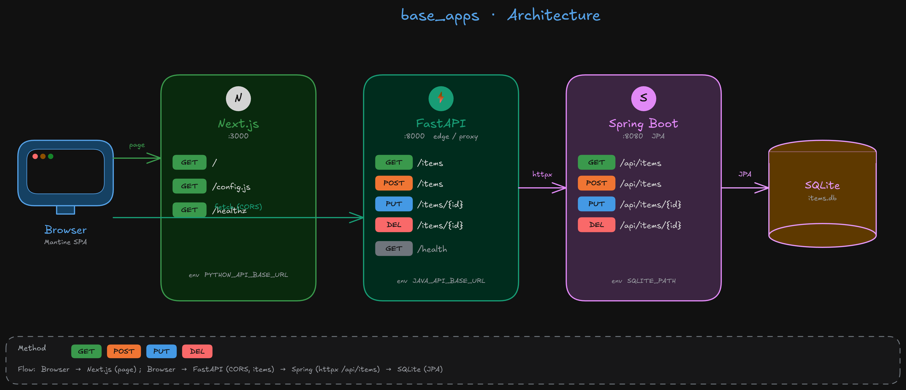

# azure-otel

> English version: [README.md](./README.md)

AKS 위에서 동작하는 multi-language 애플리케이션을 **Azure Monitor + OpenTelemetry**
스택으로 관측하는 방식의 **표준 패턴을 실험·정리**하는 레포입니다.

다음 주제를 단계별로 다룹니다:

1. **AKS + 모니터링 인프라 프로비저닝** (Bicep + azd)
2. **메트릭만 먼저** — SDK Prometheus exporter + AKS managed Prometheus + Grafana
3. **OTLP 표준화** — OpenTelemetry Collector로 traces는 App Insights, metrics는
   AMA scrape, 모든 인입은 AMPLS Private Endpoint 경유
3-1. **AKS Auto-Instrumentation (Preview)** — 3단계의 대안으로 AKS 네이티브
   `monitor.azure.com/v1` Instrumentation CR 사용, Collector 불필요.
   텔레메트리가 Application Insights로 직접 전송.
4. **연속 프로파일링 (Java)** — Grafana Pyroscope + Pyroscope Java agent 를
   strategic-merge patch 로 Spring pod 에 사이드컬 `-javaagent` 주입,
   앱 코드 무수정

각 단계는 자체 README를 갖고 있고, 앞 단계 산출물 위에 그대로 쌓이는 구조입니다.

## 샘플 워크로드 (`base_apps/`)

표준을 검증하기 위해 의도적으로 언어를 섞은 3-tier 앱을 사용합니다.

| 서비스 | 언어 / 프레임워크 | 역할 | 포트 |
|---|---|---|---|
| `nodejs` | Next.js (TypeScript) | SPA shell | 3000 |
| `python` | FastAPI | Edge / proxy | 8000 |
| `spring` | Spring Boot (Java) | CRUD + SQLite | 8080 |

호출 흐름: `브라우저 → nodejs → python → spring`. 모든 서비스는
OpenTelemetry auto-instrumentation 호환 컨테이너로 빌드됩니다.



## 단계별 가이드

### [`01_deploy_to_aks/`](./01_deploy_to_aks)
azd + Bicep으로 AKS · ACR · Log Analytics · Application Insights · Azure Monitor
Workspace · Managed Grafana · AGFC (Gateway API) · **AMPLS + Private Endpoint
(5개 Private DNS Zone 포함)** 까지 한 번에 프로비저닝하고 Helm으로 샘플 앱을
배포합니다.

### [`02_metrics_via_podmonitor/`](./02_metrics_via_podmonitor)
OpenTelemetry Operator + Instrumentation CR로 SDK가 `:9464/metrics` 를 노출하게
만들고 `PodMonitor` 로 ama-metrics 가 직접 스크레이프하게 합니다. 가장 빨리
"Grafana 에 RED 메트릭 띄우기" 가 목표.

### [`03_otel_observability/`](./03_otel_observability)
SDK는 OTLP/gRPC만 쓰고 클러스터 안의 OTel Collector 가 분기:
- **traces** → `azuremonitor` exporter → Application Insights (AMPLS 경유, private)
- **metrics** → `prometheus` exporter → ama-metrics scrape → AMW → Grafana

02단계 대시보드는 그대로 재사용 (라벨 매핑은 collector 의 `transform` 프로세서가 처리).

### [`03_1_aks_auto_instrumentation/`](./03_1_aks_auto_instrumentation)
03단계의 **대안**으로 AKS 네이티브 auto-instrumentation preview
(`AzureMonitorAppMonitoringPreview`) 를 사용합니다. AKS 가 관리하는
`monitor.azure.com/v1` Instrumentation CR 이 Azure Monitor distro 를 직접 주입하므로
OTel Collector 가 필요 없습니다. traces · requests · dependencies 가 Application
Insights 로 바로 전송됩니다. App Insights 가 유일한 백엔드일 때 적합하며,
02단계 PromQL 대시보드에는 데이터가 들어오지 않습니다 (App Insights 빌트인 화면 사용).

### [`04_profiling_with_pyroscope/`](./04_profiling_with_pyroscope)
세 번째 OTel 시그널 **profiling** 을 **Spring 서비스 한정** 으로
추가. Spring Deployment 에 strategic-merge patch 로 initContainer 가
공식 Pyroscope Java agent 를 다운로드하고 `-javaagent` 를 한 줄 추가 →
JVM 이 OTel + Pyroscope 둘 다 로드. 02·03 단계 `service` 라벨과 동일.
Python·Node 는 프로세스 부팅 코드 가 필요해 본 단계 범위 밖. OTel 네이티브
profiles 시그널은 2026-05 기준 Development 단계.

> **(선택) 브라우저 RUM** — OTel auto-instrumentation 은 서버 사이드만 잡습니다.
> 페이지 로드 / Web Vitals / 클라이언트 fetch / JS 에러까지 보고 싶다면
> [Grafana Faro Web SDK](https://grafana.com/docs/grafana-cloud/monitor-applications/frontend-observability/)
> 를 추가해 Collector(Alloy `faro.receiver`) 로 보낼 수 있습니다. Faro 트레이서가
> OTel Web 기반이라 `traceparent` 가 백엔드 span 과 그대로 이어집니다.

> **(선택) 5단계 — OTel OBI 로 eBPF 자동 계측** — [`05_ebpf_with_obi/`](./05_ebpf_with_obi)
> 참고. OpenTelemetry OBI (구 Grafana Beyla) 를 DaemonSet 으로 띄워
> 앱 코드/이미지/SDK 주입 변경 없이 HTTP·gRPC·SQL span 과 RED 메트릭을
> 커널에서 뽑아냅니다. 03 위에 얹는 방식과 SDK 주입을 대체하는 방식
> 두 가지, 그리고 Cilium 데이터플레인 · 04 Pyroscope agent 와
> 같은 노드에서 공존시키는 방법이 README 에 정리되어 있습니다.

### [`06_hubble_network_observability/`](./06_hubble_network_observability)
Azure ACNS(Advanced Container Networking Services) 를 활성화하여
**Cilium Hubble** 네트워크 관측성을 추가합니다. 01단계에서 Cilium 데이터플레인이
이미 배포되어 있으므로 `az aks update --enable-acns` 한 줄로 L3/L4/L7 플로우
가시성, DNS 모니터링, 패킷 드롭 분석이 가능합니다. **Hubble UI**를 포함합니다 (`kubectl port-forward`로 접속).

### [`07_slo_monitoring/`](./07_slo_monitoring)
02단계의 RED 메트릭 위에 [Sloth](https://sloth.dev/) 로 **SLO** 를 정의합니다.
Google SRE Workbook 패턴의 multi-window multi-burn-rate recording rules +
alert 를 자동 생성합니다. "지금 에러율이 얼마야?" 가 아닌 "이번 달 99.9% 목표를
지킬 수 있을까?" 에 답합니다.

## 전체 아키텍처

```
                                 ┌──────────────── private VNet ───────────────┐
                                 │                                              │
[Internet] ─► AGFC ─► AKS ─► app pod (OTel SDK, OTLP/gRPC)                      │
                              │                                                 │
                              ▼                                                 │
                       otel-collector ─┬─► Application Insights (via AMPLS PE)  │
                                       │                                        │
                                       └─► :8889 ◄─ ama-metrics ─► AMW ─► Grafana
                                 │                                              │
                                 └──────────────────────────────────────────────┘
```

자세한 그림은 [`docs/diagrams/`](./docs/diagrams) 참고 (Excalidraw).

## 빠른 시작

```powershell
# 1. 인프라 + Helm 배포
cd 01_deploy_to_aks
azd up
# (README의 Helm install 명령 실행)

# 2. 메트릭 파이프라인
kubectl apply -f ..\02_metrics_via_podmonitor\manifests\

# 3. OTLP / Collector 로 전환
cd ..\
# 02단계 산출물 정리 후 03_otel_observability/README.md 따라 진행

# 3-1. (대안) AKS 네이티브 auto-instrumentation
# 03 대신 03_1_aks_auto_instrumentation/README_KR.md 따라 진행

# 4. 연속 프로파일링 (Pyroscope + Alloy eBPF)
# 04_profiling_with_pyroscope/README.md 따라 진행
```

각 단계 README가 정확한 명령과 검증 방법을 포함합니다.

## 사용 기술

- **Compute / Network**: AKS (Azure CNI overlay + Cilium), AGFC (Gateway API), VNet, Private Endpoint
- **Observability**: OpenTelemetry SDK / Operator / Collector, Application Insights, Azure Monitor Workspace (managed Prometheus), Azure Managed Grafana, AMPLS, Grafana Pyroscope (Java agent), Cilium Hubble (ACNS), Sloth (SLO)
- **Build / Deploy**: Bicep, Azure Developer CLI (azd), Helm, GitHub Container Registry
